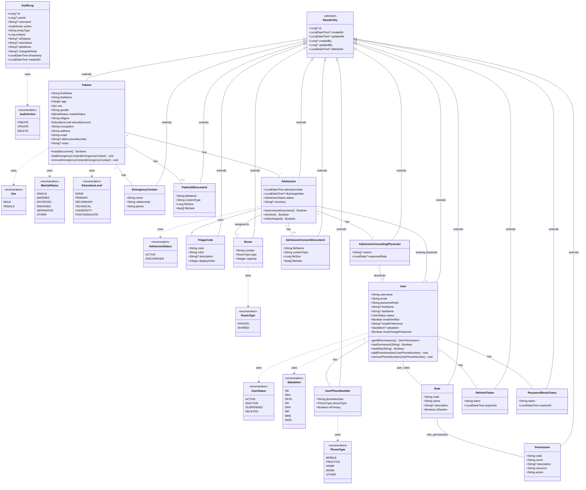

# Entity Class Diagram

## Entity Relationships

| Relationship | Type | Join Table | Description |
|-------------|------|------------|-------------|
| User ↔ Role | ManyToMany | `user_roles` | Users can have multiple roles |
| Role ↔ Permission | ManyToMany | `role_permissions` | Roles can have multiple permissions |
| User → RefreshToken | OneToMany | - | Users can have multiple active refresh tokens |
| User → PasswordResetToken | OneToMany | - | Users can have multiple password reset tokens |
| User → UserPhoneNumber | OneToMany | - | Users can have multiple phone numbers |
| Patient → EmergencyContact | OneToMany | - | Patients can have multiple emergency contacts |
| Patient → PatientIdDocument | OneToOne | - | Patient can have one ID document (optional) |
| Patient → Admission | OneToMany | - | Patients can have multiple admissions |
| Admission → TriageCode | ManyToOne | - | Each admission has a triage code |
| Admission → Room | ManyToOne | - | Each admission is assigned to a room |
| Admission → User (treating) | ManyToOne | - | Each admission has a treating physician |
| Admission → AdmissionConsentDocument | OneToOne | - | Admission can have one consent document (optional) |
| Admission → AdmissionConsultingPhysician | OneToMany | - | Admissions can have multiple consulting physicians |
| AdmissionConsultingPhysician → User | ManyToOne | - | Each consulting record references a physician |

## Notes

- **BaseEntity**: Abstract mapped superclass providing common audit fields and soft delete support
- **AuditLog**: Standalone entity (does not extend BaseEntity) - audit logs are immutable records
- **Soft Deletes**: All entities except AuditLog use `@SQLRestriction("deleted_at IS NULL")`
- **Audit Trail**: All entities extending BaseEntity track who created/updated them via createdBy/updatedBy fields (reference User)
