# Entity Class Diagram

```mermaid
classDiagram
    direction TB

    %% Base Entity (MappedSuperclass)
    class BaseEntity {
        <<abstract>>
        +Long? id
        +LocalDateTime? createdAt
        +LocalDateTime? updatedAt
        +Long? createdBy
        +Long? updatedBy
        +LocalDateTime? deletedAt
    }

    %% ── User & Auth Enums ──

    class UserStatus {
        <<enumeration>>
        ACTIVE
        INACTIVE
        SUSPENDED
        DELETED
    }

    class Salutation {
        <<enumeration>>
        SR
        SRA
        SRTA
        DR
        DRA
        LIC
        LICDA
        MR
        MRS
        MISS
    }

    class PhoneType {
        <<enumeration>>
        MOBILE
        PRACTICE
        HOME
        WORK
        OTHER
    }

    class AuditAction {
        <<enumeration>>
        CREATE
        UPDATE
        DELETE
    }

    %% ── Patient Enums ──

    class Sex {
        <<enumeration>>
        MALE
        FEMALE
    }

    class MaritalStatus {
        <<enumeration>>
        SINGLE
        MARRIED
        DIVORCED
        WIDOWED
        SEPARATED
        OTHER
    }

    class EducationLevel {
        <<enumeration>>
        NONE
        PRIMARY
        SECONDARY
        TECHNICAL
        UNIVERSITY
        POSTGRADUATE
    }

    %% ── Admission Enums ──

    class AdmissionStatus {
        <<enumeration>>
        ACTIVE
        DISCHARGED
    }

    class AdmissionType {
        <<enumeration>>
        HOSPITALIZATION
        AMBULATORY
        ELECTROSHOCK_THERAPY
        KETAMINE_INFUSION
        EMERGENCY
    }

    class RoomType {
        <<enumeration>>
        PRIVATE
        SHARED
    }

    class RoomGender {
        <<enumeration>>
        MALE
        FEMALE
    }

    %% ── Medical Order Enums ──

    class MedicalOrderCategory {
        <<enumeration>>
        ORDENES_MEDICAS
        MEDICAMENTOS
        LABORATORIOS
        REFERENCIAS_MEDICAS
        PRUEBAS_PSICOMETRICAS
        ACTIVIDAD_FISICA
        CUIDADOS_ESPECIALES
        DIETA
        RESTRICCIONES_MOVILIDAD
        PERMISOS_VISITA
        OTRAS
    }

    class MedicalOrderStatus {
        <<enumeration>>
        ACTIVE
        DISCONTINUED
    }

    class AdministrationRoute {
        <<enumeration>>
        ORAL
        IV
        IM
        SC
        TOPICAL
        INHALATION
        RECTAL
        SUBLINGUAL
        OTHER
    }

    %% ── Inventory Enums ──

    class PricingType {
        <<enumeration>>
        FLAT
        TIME_BASED
    }

    class TimeUnit {
        <<enumeration>>
        MINUTES
        HOURS
    }

    class MovementType {
        <<enumeration>>
        ENTRY
        EXIT
    }

    %% ── Billing Enums ──

    class ChargeType {
        <<enumeration>>
        MEDICATION
        ROOM
        PROCEDURE
        LAB
        SERVICE
        ADJUSTMENT
    }

    %% ══════════════════════════════════════
    %% ENTITIES - User & Authentication
    %% ══════════════════════════════════════

    class User {
        +String username
        +String email
        +String passwordHash
        +String? firstName
        +String? lastName
        +UserStatus status
        +Boolean emailVerified
        +String? localePreference
        +Salutation? salutation
        +Boolean mustChangePassword
        +getAllPermissions() Set~Permission~
        +hasPermission(String) Boolean
        +hasRole(String) Boolean
    }

    class UserPhoneNumber {
        +String phoneNumber
        +PhoneType phoneType
        +Boolean isPrimary
    }

    class Role {
        +String code
        +String name
        +String? description
        +Boolean isSystem
    }

    class Permission {
        +String code
        +String name
        +String? description
        +String resource
        +String action
    }

    class RefreshToken {
        +String token
        +LocalDateTime expiresAt
    }

    class PasswordResetToken {
        +String token
        +LocalDateTime expiresAt
    }

    class AuditLog {
        +Long? id
        +Long? userId
        +String? username
        +AuditAction action
        +String entityType
        +Long entityId
        +String? oldValues
        +String? newValues
        +String? ipAddress
        +String? changedFields
        +LocalDateTime timestamp
        +LocalDateTime createdAt
    }

    %% ══════════════════════════════════════
    %% ENTITIES - Patient Management
    %% ══════════════════════════════════════

    class Patient {
        +String firstName
        +String lastName
        +Integer age
        +Sex sex
        +String gender
        +MaritalStatus maritalStatus
        +String religion
        +EducationLevel educationLevel
        +String occupation
        +String address
        +String email
        +String? idDocumentNumber
        +String? notes
    }

    class EmergencyContact {
        +String name
        +String relationship
        +String phone
    }

    class PatientIdDocument {
        +String fileName
        +String contentType
        +Long fileSize
        +String storagePath
    }

    %% ══════════════════════════════════════
    %% ENTITIES - Admission Management
    %% ══════════════════════════════════════

    class TriageCode {
        +String code
        +String color
        +String? description
        +Integer displayOrder
    }

    class Room {
        +String number
        +RoomType type
        +RoomGender gender
        +Integer capacity
        +BigDecimal? price
        +BigDecimal? cost
    }

    class Admission {
        +LocalDateTime admissionDate
        +LocalDateTime? dischargeDate
        +AdmissionStatus status
        +AdmissionType type
        +String? inventory
        +hasConsentDocument() Boolean
        +isActive() Boolean
        +isDischarged() Boolean
    }

    class AdmissionConsentDocument {
        +String fileName
        +String contentType
        +Long fileSize
        +String storagePath
    }

    class AdmissionConsultingPhysician {
        +String? reason
        +LocalDate? requestedDate
    }

    class DocumentType {
        +String code
        +String name
        +String? description
        +Integer displayOrder
    }

    class AdmissionDocument {
        +String displayName
        +String fileName
        +String contentType
        +Long fileSize
        +String storagePath
        +String? thumbnailPath
    }

    %% ══════════════════════════════════════
    %% ENTITIES - Medical Records
    %% ══════════════════════════════════════

    class ClinicalHistory {
        +String? reasonForAdmission
        +String? historyOfPresentIllness
        +String? psychiatricHistory
        +String? medicalHistory
        +String? familyHistory
        +String? personalHistory
        +String? substanceUseHistory
        +String? legalHistory
        +String? socialHistory
        +String? developmentalHistory
        +String? educationalOccupationalHistory
        +String? sexualHistory
        +String? religiousSpiritualHistory
        +String? mentalStatusExam
        +String? physicalExam
        +String? diagnosticImpression
        +String? treatmentPlan
        +String? riskAssessment
        +String? prognosis
        +String? informedConsentNotes
        +String? additionalNotes
    }

    class ProgressNote {
        +String? subjectiveData
        +String? objectiveData
        +String? analysis
        +String? actionPlans
    }

    class MedicalOrder {
        +MedicalOrderCategory category
        +LocalDate startDate
        +LocalDate? endDate
        +String? medication
        +String? dosage
        +AdministrationRoute? route
        +String? frequency
        +String? schedule
        +String? observations
        +MedicalOrderStatus status
        +LocalDateTime? discontinuedAt
        +Long? discontinuedBy
    }

    %% ══════════════════════════════════════
    %% ENTITIES - Psychotherapy
    %% ══════════════════════════════════════

    class PsychotherapyCategory {
        +String name
        +String? description
        +Integer displayOrder
        +Boolean active
    }

    class PsychotherapyActivity {
        +String description
    }

    %% ══════════════════════════════════════
    %% ENTITIES - Nursing
    %% ══════════════════════════════════════

    class NursingNote {
        +String description
    }

    class VitalSign {
        +LocalDateTime recordedAt
        +Integer systolicBp
        +Integer diastolicBp
        +Integer heartRate
        +Integer respiratoryRate
        +BigDecimal temperature
        +Integer oxygenSaturation
        +String? other
    }

    %% ══════════════════════════════════════
    %% ENTITIES - Inventory Management
    %% ══════════════════════════════════════

    class InventoryCategory {
        +String name
        +String? description
        +Integer displayOrder
        +Boolean active
    }

    class InventoryItem {
        +String name
        +String? description
        +BigDecimal price
        +BigDecimal cost
        +Integer quantity
        +Integer restockLevel
        +PricingType pricingType
        +TimeUnit? timeUnit
        +Integer? timeInterval
        +Boolean active
    }

    class InventoryMovement {
        +MovementType movementType
        +Integer quantity
        +Integer previousQuantity
        +Integer newQuantity
        +String? notes
    }

    %% ══════════════════════════════════════
    %% ENTITIES - Billing
    %% ══════════════════════════════════════

    class PatientCharge {
        +ChargeType chargeType
        +String description
        +Integer quantity
        +BigDecimal unitPrice
        +BigDecimal totalAmount
        +LocalDate chargeDate
        +String? reason
    }

    class Invoice {
        +String invoiceNumber
        +BigDecimal totalAmount
        +Integer chargeCount
        +String? notes
    }

    %% ══════════════════════════════════════
    %% INHERITANCE
    %% ══════════════════════════════════════

    BaseEntity <|-- User : extends
    BaseEntity <|-- UserPhoneNumber : extends
    BaseEntity <|-- Role : extends
    BaseEntity <|-- Permission : extends
    BaseEntity <|-- RefreshToken : extends
    BaseEntity <|-- PasswordResetToken : extends
    BaseEntity <|-- Patient : extends
    BaseEntity <|-- EmergencyContact : extends
    BaseEntity <|-- PatientIdDocument : extends
    BaseEntity <|-- TriageCode : extends
    BaseEntity <|-- Room : extends
    BaseEntity <|-- Admission : extends
    BaseEntity <|-- AdmissionConsentDocument : extends
    BaseEntity <|-- AdmissionConsultingPhysician : extends
    BaseEntity <|-- DocumentType : extends
    BaseEntity <|-- AdmissionDocument : extends
    BaseEntity <|-- ClinicalHistory : extends
    BaseEntity <|-- ProgressNote : extends
    BaseEntity <|-- MedicalOrder : extends
    BaseEntity <|-- PsychotherapyCategory : extends
    BaseEntity <|-- PsychotherapyActivity : extends
    BaseEntity <|-- NursingNote : extends
    BaseEntity <|-- VitalSign : extends
    BaseEntity <|-- InventoryCategory : extends
    BaseEntity <|-- InventoryItem : extends
    BaseEntity <|-- InventoryMovement : extends
    BaseEntity <|-- PatientCharge : extends
    BaseEntity <|-- Invoice : extends

    %% ══════════════════════════════════════
    %% ASSOCIATIONS
    %% ══════════════════════════════════════

    %% User & Auth
    User "1" -- "*" RefreshToken : has
    User "1" -- "*" PasswordResetToken : has
    User "1" -- "*" UserPhoneNumber : has
    User "*" -- "*" Role : user_roles
    Role "*" -- "*" Permission : role_permissions

    %% Patient
    Patient "1" -- "*" EmergencyContact : has
    Patient "1" -- "0..1" PatientIdDocument : has
    Patient "1" -- "*" Admission : has

    %% Admission
    Admission "*" -- "0..1" TriageCode : uses
    Admission "*" -- "0..1" Room : assigned to
    Admission "*" -- "1" User : treating physician
    Admission "1" -- "0..1" AdmissionConsentDocument : has
    Admission "1" -- "*" AdmissionConsultingPhysician : has
    AdmissionConsultingPhysician "*" -- "1" User : physician
    Admission "1" -- "*" AdmissionDocument : has
    AdmissionDocument "*" -- "1" DocumentType : categorized by

    %% Medical Records
    Admission "1" -- "0..1" ClinicalHistory : has
    Admission "1" -- "*" ProgressNote : has
    Admission "1" -- "*" MedicalOrder : has

    %% Psychotherapy
    Admission "1" -- "*" PsychotherapyActivity : has
    PsychotherapyActivity "*" -- "1" PsychotherapyCategory : categorized by

    %% Nursing
    Admission "1" -- "*" NursingNote : has
    Admission "1" -- "*" VitalSign : has

    %% Inventory
    InventoryItem "*" -- "1" InventoryCategory : belongs to
    InventoryMovement "*" -- "1" InventoryItem : tracks
    InventoryMovement "*" -- "0..1" Admission : linked to

    %% Billing
    PatientCharge "*" -- "1" Admission : charged to
    PatientCharge "*" -- "0..1" InventoryItem : references
    PatientCharge "*" -- "0..1" Room : references
    PatientCharge "*" -- "0..1" Invoice : included in
    Invoice "*" -- "1" Admission : generated for

    %% ══════════════════════════════════════
    %% ENUM USAGE
    %% ══════════════════════════════════════

    User ..> UserStatus : uses
    User ..> Salutation : uses
    UserPhoneNumber ..> PhoneType : uses
    AuditLog ..> AuditAction : uses
    Patient ..> Sex : uses
    Patient ..> MaritalStatus : uses
    Patient ..> EducationLevel : uses
    Admission ..> AdmissionStatus : uses
    Admission ..> AdmissionType : uses
    Room ..> RoomType : uses
    Room ..> RoomGender : uses
    MedicalOrder ..> MedicalOrderCategory : uses
    MedicalOrder ..> MedicalOrderStatus : uses
    MedicalOrder ..> AdministrationRoute : uses
    InventoryItem ..> PricingType : uses
    InventoryItem ..> TimeUnit : uses
    InventoryMovement ..> MovementType : uses
    PatientCharge ..> ChargeType : uses
```

## Entity Relationships

| Relationship | Type | Join Table | Description |
|-------------|------|------------|-------------|
| User ↔ Role | ManyToMany | `user_roles` | Users can have multiple roles |
| Role ↔ Permission | ManyToMany | `role_permissions` | Roles can have multiple permissions |
| User → RefreshToken | OneToMany | - | Users can have multiple active refresh tokens |
| User → PasswordResetToken | OneToMany | - | Users can have multiple password reset tokens |
| User → UserPhoneNumber | OneToMany | - | Users can have multiple phone numbers |
| Patient → EmergencyContact | OneToMany | - | Patients can have multiple emergency contacts |
| Patient → PatientIdDocument | OneToOne | - | Patient can have one ID document (optional) |
| Patient → Admission | OneToMany | - | Patients can have multiple admissions |
| Admission → TriageCode | ManyToOne | - | Each admission may have a triage code (optional for some types) |
| Admission → Room | ManyToOne | - | Each admission may be assigned to a room (optional for some types) |
| Admission → User (treating) | ManyToOne | - | Each admission has a treating physician |
| Admission → AdmissionConsentDocument | OneToOne | - | Admission can have one consent document (optional) |
| Admission → AdmissionConsultingPhysician | OneToMany | - | Admissions can have multiple consulting physicians |
| AdmissionConsultingPhysician → User | ManyToOne | - | Each consulting record references a physician |
| Admission → AdmissionDocument | OneToMany | - | Admissions can have multiple uploaded documents |
| AdmissionDocument → DocumentType | ManyToOne | - | Each document is categorized by a document type |
| Admission → ClinicalHistory | OneToOne | - | Each admission has one clinical history (optional) |
| Admission → ProgressNote | OneToMany | - | Admissions can have multiple SOAP progress notes |
| Admission → MedicalOrder | OneToMany | - | Admissions can have multiple medical orders |
| Admission → PsychotherapyActivity | OneToMany | - | Admissions can have multiple psychotherapy activities |
| PsychotherapyActivity → PsychotherapyCategory | ManyToOne | - | Each activity belongs to a category |
| Admission → NursingNote | OneToMany | - | Admissions can have multiple nursing notes |
| Admission → VitalSign | OneToMany | - | Admissions can have multiple vital sign records |
| InventoryItem → InventoryCategory | ManyToOne | - | Each item belongs to a category |
| InventoryMovement → InventoryItem | ManyToOne | - | Each movement tracks an inventory item |
| InventoryMovement → Admission | ManyToOne | - | Movement can be linked to an admission (optional) |
| PatientCharge → Admission | ManyToOne | - | Each charge is linked to an admission |
| PatientCharge → InventoryItem | ManyToOne | - | Charge can reference an inventory item (optional) |
| PatientCharge → Room | ManyToOne | - | Charge can reference a room for room charges (optional) |
| PatientCharge → Invoice | ManyToOne | - | Charge can be included in an invoice (optional) |
| Invoice → Admission | ManyToOne | - | Each invoice is generated for an admission |

## Notes

- **BaseEntity**: Abstract mapped superclass providing common audit fields and soft delete support
- **AuditLog**: Standalone entity (does not extend BaseEntity) - audit logs are immutable records
- **Soft Deletes**: All entities except AuditLog use `@SQLRestriction("deleted_at IS NULL")`
- **Audit Trail**: All entities extending BaseEntity track who created/updated them via createdBy/updatedBy fields (reference User)
- **File Storage**: PatientIdDocument, AdmissionConsentDocument, and AdmissionDocument store files on the local file system via `storagePath` (not in database BYTEA columns)
- **Immutable Charges**: PatientCharge records are append-only; corrections are made via ADJUSTMENT charge type with negative amounts
- **Admission as Hub**: The Admission entity is the central hub connecting patients to all clinical modules (medical records, nursing, psychotherapy, inventory, billing)
