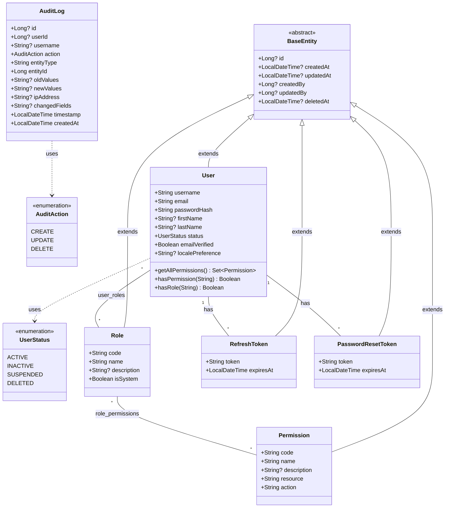

# Entity Class Diagram

## Entity Relationships

| Relationship | Type | Join Table | Description |
|-------------|------|------------|-------------|
| User ↔ Role | ManyToMany | `user_roles` | Users can have multiple roles |
| Role ↔ Permission | ManyToMany | `role_permissions` | Roles can have multiple permissions |
| User → RefreshToken | OneToMany | - | Users can have multiple active refresh tokens |
| User → PasswordResetToken | OneToMany | - | Users can have multiple password reset tokens |

## Notes

- **BaseEntity**: Abstract mapped superclass providing common audit fields and soft delete support
- **AuditLog**: Standalone entity (does not extend BaseEntity) - audit logs are immutable records
- **Soft Deletes**: All entities except AuditLog use `@SQLRestriction("deleted_at IS NULL")`
