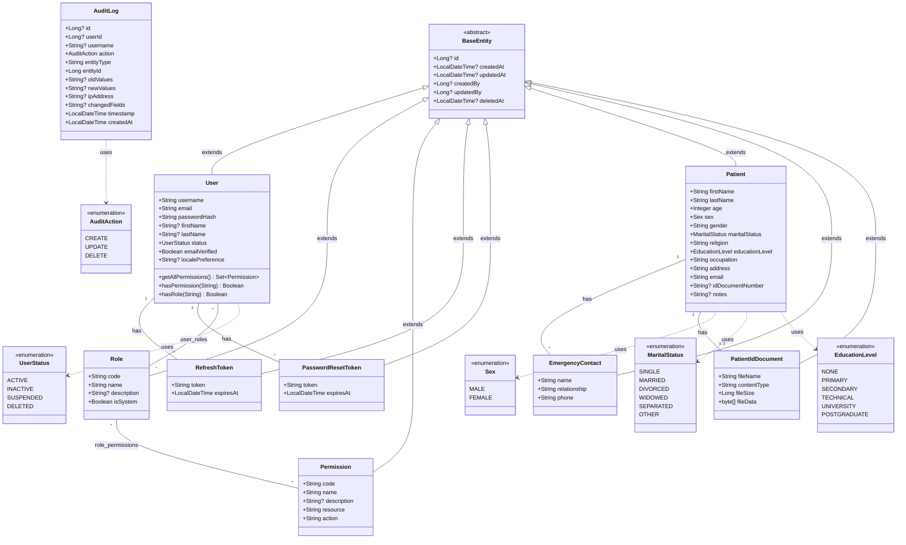

# Entity Class Diagram

## Entity Relationships

| Relationship | Type | Join Table | Description |
|-------------|------|------------|-------------|
| User ↔ Role | ManyToMany | `user_roles` | Users can have multiple roles |
| Role ↔ Permission | ManyToMany | `role_permissions` | Roles can have multiple permissions |
| User → RefreshToken | OneToMany | - | Users can have multiple active refresh tokens |
| User → PasswordResetToken | OneToMany | - | Users can have multiple password reset tokens |
| Patient → EmergencyContact | OneToMany | - | Patients can have multiple emergency contacts |
| Patient → PatientIdDocument | OneToOne | - | Patient can have one ID document (optional) |

## Notes

- **BaseEntity**: Abstract mapped superclass providing common audit fields and soft delete support
- **AuditLog**: Standalone entity (does not extend BaseEntity) - audit logs are immutable records
- **Soft Deletes**: All entities except AuditLog and Patient use `@SQLRestriction("deleted_at IS NULL")`
- **Patient Records**: Patient entities extend BaseEntity but are **never deleted** to maintain medical record integrity (deleted_at field exists but is not used)
- **Audit Trail**: Patient, EmergencyContact, and PatientIdDocument entities track who created/updated them via BaseEntity fields (createdBy, updatedBy reference User)
