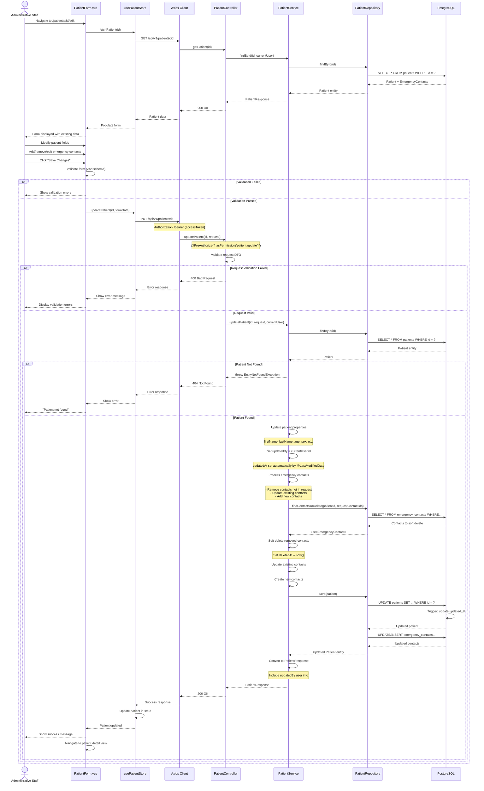
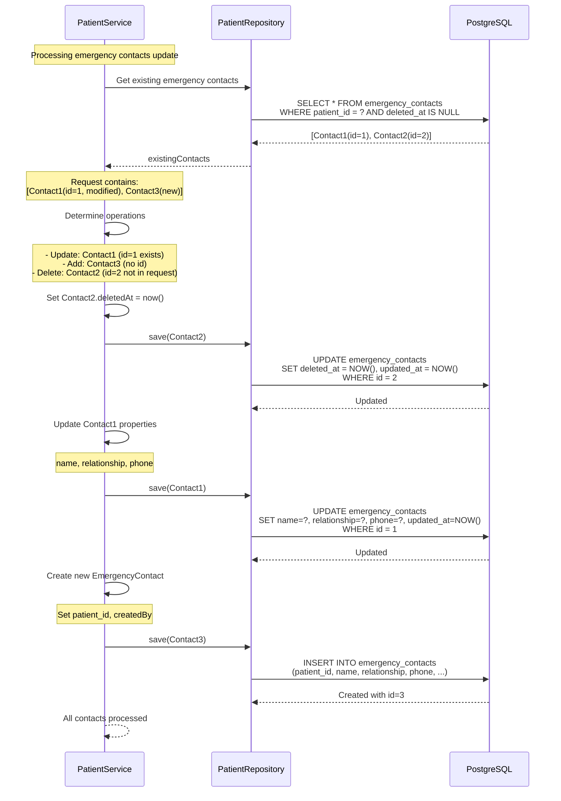
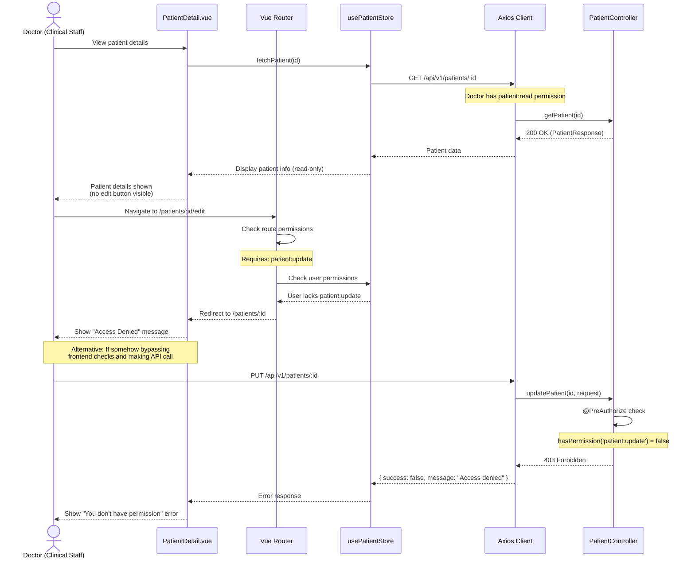
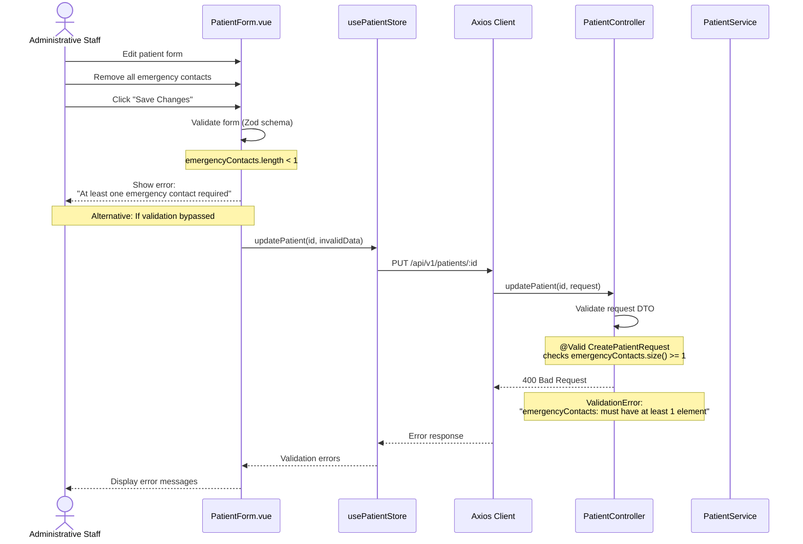
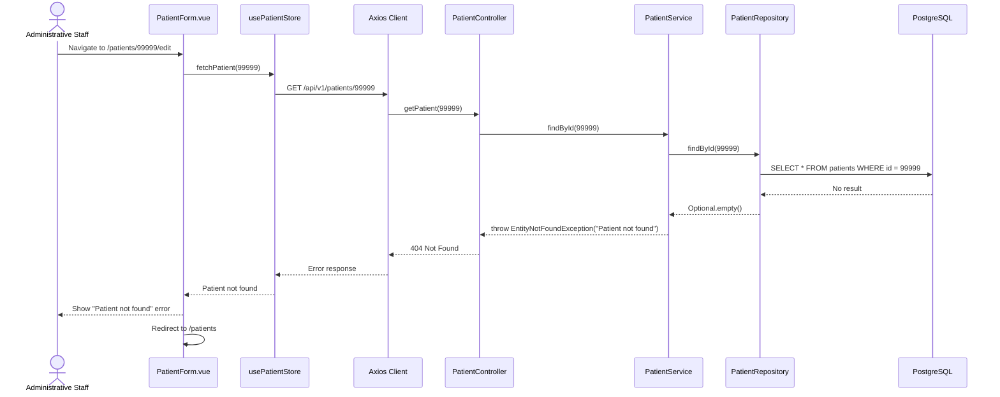

# Edit Patient Registration - Sequence Diagram

## Happy Path: Update Existing Patient

---

## Emergency Contact Management Detail

---

## Permission Denied Scenario (Clinical Staff)

---

## Validation Error Scenario

---

## Patient Not Found Scenario

---

## Key Components

### Frontend
- **PatientForm.vue**: Patient edit form (same component as create, different mode)
- **PatientDetail.vue**: Read-only view for clinical staff
- **usePatientStore**: Manages patient state and API calls
- **Router Guards**: Check permissions before allowing navigation to edit routes

### Backend
- **PatientController**: REST endpoint (`PUT /api/v1/patients/{id}`)
- **PatientService**: Update logic, contact management, audit trail
- **PatientRepository**: JPA repository for database operations

### Security
- **JWT Access Token**: Required in Authorization header
- **Permission Check**: `patient:update` permission required (ADMIN, ADMINISTRATIVE_STAFF only)
- **Audit Trail**: `updatedBy` and `updatedAt` automatically set via JPA auditing

### Database Operations
- **Update patient**: Single UPDATE statement
- **Emergency contacts**:
  - Soft delete removed contacts (SET deleted_at)
  - Update existing contacts (UPDATE)
  - Insert new contacts (INSERT)
- **Transaction**: All operations in single transaction (rollback on error)

---

## Notes

1. **Emergency Contact Management**:
   - Existing contacts with IDs → UPDATE
   - New contacts without IDs → INSERT
   - Contacts missing from request → Soft DELETE (set `deleted_at`)
   - Minimum 1 contact enforced on both frontend and backend

2. **Audit Trail**:
   - `updatedBy` set from `SecurityContextHolder` current user
   - `updatedAt` set automatically by JPA `@LastModifiedDate`
   - Audit info returned in response for display

3. **Permission Model**:
   - **ADMIN, ADMINISTRATIVE_STAFF**: Can edit patients
   - **DOCTOR, NURSE, CHIEF_NURSE**: Read-only access
   - Frontend hides edit buttons for non-authorized users
   - Backend enforces with `@PreAuthorize` annotations

4. **Validation Layers**:
   - **Frontend**: Zod schema validation (immediate feedback)
   - **Backend**: Spring Validation annotations (server-side enforcement)
   - Both layers check emergency contact minimum requirement

5. **Optimistic Locking** (Future Enhancement):
   - Currently not implemented
   - Could add `@Version` field to prevent concurrent update conflicts
   - Would return 409 Conflict if version mismatch detected

6. **ID Document Handling**:
   - ID document upload/removal handled by separate endpoints
   - Not part of patient update flow
   - See `id-document-upload-sequence.md` for details
