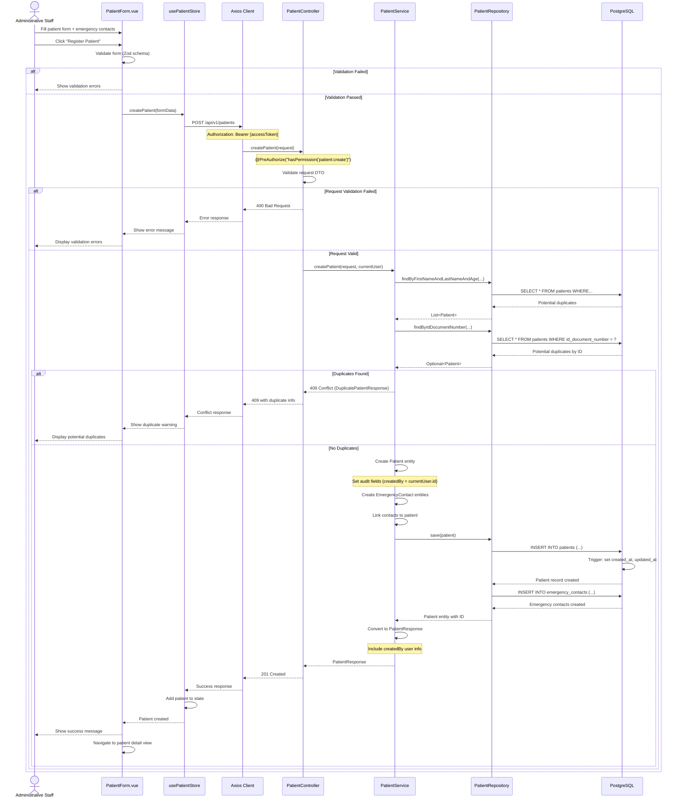
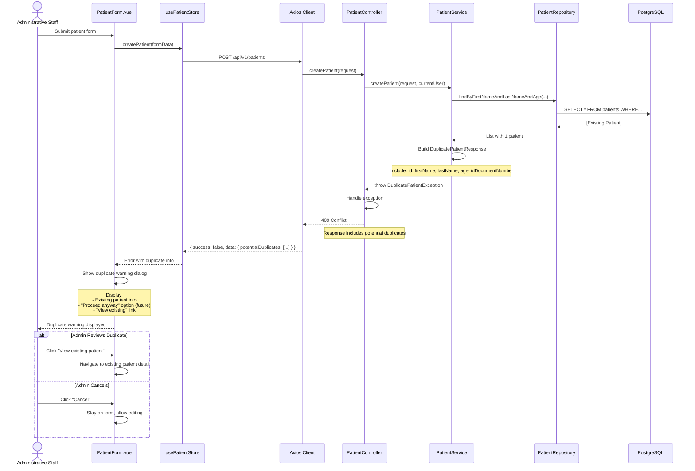
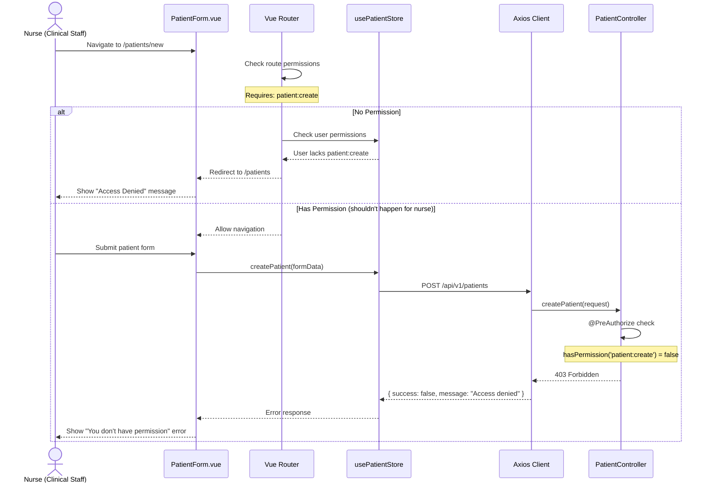

# Patient Registration - Sequence Diagram

## Happy Path: Create New Patient

---

## Edge Case: Duplicate Detection

---

## Permission Denied Scenario

---

## Key Components

### Frontend
- **PatientForm.vue**: Patient registration form with validation
- **usePatientStore**: Pinia store managing patient state and API calls
- **Zod Schema**: Client-side validation for patient data

### Backend
- **PatientController**: REST endpoint (`POST /api/v1/patients`)
- **PatientService**: Business logic, duplicate detection, entity creation
- **PatientRepository**: JPA repository for database operations

### Security
- **JWT Access Token**: Required in Authorization header
- **Permission Check**: `patient:create` permission required
- **Audit Trail**: `createdBy` and `createdAt` automatically set via JPA auditing

### Database
- **patients**: Main patient table
- **emergency_contacts**: Related emergency contact records
- **patient_id_documents**: Optional ID document storage (added separately via file upload)

---

## Notes

1. **Duplicate Detection Logic**:
   - Match by `firstName + lastName + age` OR `idDocumentNumber`
   - Returns 409 Conflict with list of potential duplicates
   - Frontend shows warning dialog

2. **Validation Layers**:
   - **Frontend**: Zod schema validation (immediate feedback)
   - **Backend**: Spring Validation annotations (server-side enforcement)

3. **Audit Trail**:
   - `createdBy` set from `SecurityContextHolder` current user
   - `createdAt` set automatically by JPA `@CreatedDate`
   - Audit info returned in response for display

4. **Emergency Contacts**:
   - Minimum 1 required (validated on both frontend and backend)
   - Created in same transaction as patient
   - Cascade operations handled by JPA

5. **ID Document Upload**:
   - **Not** part of initial registration
   - Separate API call: `POST /api/v1/patients/{id}/id-document`
   - See `id-document-upload-sequence.md` for details
